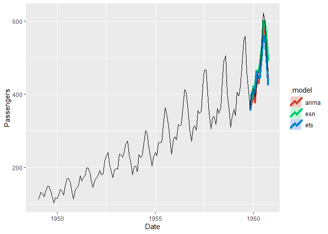

<!-- README.md is generated from README.Rmd. Please edit that file -->

# echos

<!-- badges: start -->

<!-- badges: end -->

This package provides a tidy R interface for modeling and forecasting
univariate time series using Echo State Networks (ESNs). The model works
within the `fable` framework provided by the `fabletools` package, which
provides the tools to evaluate, visualise, and combine models in a
workflow consistent with the tidyverse.

## Installation

You can install the development version from
[GitHub](https://github.com/) with:

``` r
# install.packages("devtools")
devtools::install_github("ahaeusser/echos")
```

## Usage

### Load packages

``` r
library(echos)
library(dplyr)
library(tsibble)
library(fabletools)
library(fable)
```

### Prepare data

``` r
n_train <- 130  # training window
n_ahead <- 12   # testing window (forecast horizon)

# Prepare data as tsibble
data <- AirPassengers %>%
  as_tsibble() %>%
  rename(
    Date = index,
    Passengers = value)

# Training data
data_train <- data %>%
  slice(1:n_train)

data_train
#> # A tsibble: 130 x 2 [1M]
#>        Date Passengers
#>       <mth>      <dbl>
#>  1 1949 Jan        112
#>  2 1949 Feb        118
#>  3 1949 Mrz        132
#>  4 1949 Apr        129
#>  5 1949 Mai        121
#>  6 1949 Jun        135
#>  7 1949 Jul        148
#>  8 1949 Aug        148
#>  9 1949 Sep        136
#> 10 1949 Okt        119
#> # ... with 120 more rows

# Testing data
data_test <- data %>%
  slice((n_train + 1):(n_train + n_ahead))

data_test
#> # A tsibble: 12 x 2 [1M]
#>        Date Passengers
#>       <mth>      <dbl>
#>  1 1959 Nov        362
#>  2 1959 Dez        405
#>  3 1960 Jan        417
#>  4 1960 Feb        391
#>  5 1960 Mrz        419
#>  6 1960 Apr        461
#>  7 1960 Mai        472
#>  8 1960 Jun        535
#>  9 1960 Jul        622
#> 10 1960 Aug        606
#> 11 1960 Sep        508
#> 12 1960 Okt        461
```

### Model

``` r
lags <- list(c(1, 2, 3, 4, 12))
n_trig <- 0
period <- 12
n_diff <- 1

models <- data_train %>%
  model(
    esn = ESN(
      Passengers,
      lags = lags,
      n_trig = n_trig,
      period = period,
      n_diff = n_diff),
    arima = ARIMA(Passengers),
    ets = ETS(Passengers))

models
#> # A mable: 1 x 3
#>   esn                                 arima                          ets        
#>   <model>                             <model>                        <model>    
#> 1 <ESN({6,200,1}, {0.99,1.5,0}, {(12~ <ARIMA(3,0,0)(0,1,0)[12] w/ d~ <ETS(M,Ad,~
```

### Forecast

``` r
fcsts <- models %>%
  forecast(h = n_ahead)

fcsts
#> # A fable: 36 x 4 [1M]
#> # Key:     .model [3]
#>    .model     Date Passengers .distribution  
#>    <chr>     <mth>      <dbl> <dist>         
#>  1 esn    1959 Nov       380. N(380, 1.7e-05)
#>  2 esn    1959 Dez       389. N(389, 2.8e-05)
#>  3 esn    1960 Jan       422. N(422, 4.6e-05)
#>  4 esn    1960 Feb       421. N(421, 4.8e-05)
#>  5 esn    1960 Mrz       466. N(466, 6.6e-05)
#>  6 esn    1960 Apr       460. N(460, 8.2e-05)
#>  7 esn    1960 Mai       485. N(485, 8.0e-05)
#>  8 esn    1960 Jun       530. N(530, 8.4e-05)
#>  9 esn    1960 Jul       601. N(601, 8.8e-05)
#> 10 esn    1960 Aug       600. N(600, 9.8e-05)
#> # ... with 26 more rows
```

### Visualize

``` r
fcsts %>%
  autoplot(
    rbind(data_train, data_test),
    level = NULL,
    size = 1.5)
```



## Work in Progress

  - Implement specials
      - `const()` - intercept term
      - `ar()` - autoregressive lags
      - `trig()` - trigonometric terms for seasonality
      - `xreg()` - exogenuous regressors
  - Implement further functions
      - `report.ESN()`
      - `tidy.ESN()`
      - `refit.ESN()`
      - `generate.ESN()`
      - `stream.ESN()`
      - `reservoir.ESN()`
      - …
  - Enhance to mulitvariate time series
  - Automatic selection of inputs (intercept, autoregressive lags, etc.)
