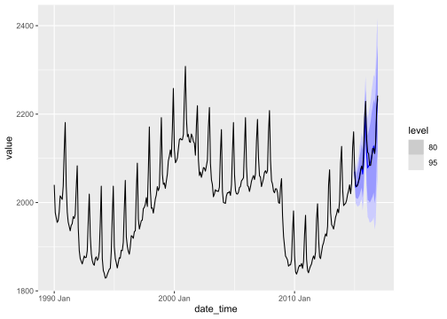

<!-- README.md is generated from README.Rmd. Please edit that file -->

# echos

<!-- badges: start -->

[](https://www.tidyverse.org/lifecycle/#experimental)
<!-- badges: end -->

This package provides a tidy R interface for modeling and forecasting
univariate time series using Echo State Networks (ESNs). The model works
within the `fable` framework provided by the `fabletools` package, which
provides the tools to evaluate, visualise, and combine models in a
workflow consistent with the tidyverse.

## Installation

You can install the development version from
[GitHub](https://github.com/) with:

``` r
# install.packages("devtools")
devtools::install_github("ahaeusser/echos")
```

## Usage

### Load packages

``` r
library(echos)
library(tscv)
library(dplyr)
library(tsibble)
library(fabletools)
library(fable)
Sys.setlocale("LC_TIME", "C")
#> [1] "C"
```

### Prepare data

``` r

# Prepare dataset
data <- elec_price %>%
  tscv::clean_data()

# Setup for time series cross validation
n_init <- 2400   # size for training window
n_ahead <- 24    # size for testing window (forecast horizon)
mode <- "slide"  # fixed window approach
n_skip <- 23     # skip 23 observations
n_lag <- 0       # no lag

data <- data %>%
  tscv::split_data(
    n_init = n_init,
    n_ahead = n_ahead,
    mode = mode,
    n_skip = n_skip,
    n_lag = n_lag)

# Use only a small sample of data
data <- data %>%
  filter(BZN == "SE1") %>%
  filter(split == 10)

data
#> # A tsibble: 2,424 x 9 [1h] <UTC>
#> # Key:       Series, Unit, BZN, split [1]
#>    Time                Series      Unit   BZN   Value split    id sample horizon
#>    <dttm>              <chr>       <chr>  <chr> <dbl> <int> <int> <chr>    <int>
#>  1 2019-01-10 00:00:00 Day-ahead ~ [EUR/~ SE1    50.0    10   217 train       NA
#>  2 2019-01-10 01:00:00 Day-ahead ~ [EUR/~ SE1    49.6    10   218 train       NA
#>  3 2019-01-10 02:00:00 Day-ahead ~ [EUR/~ SE1    50.0    10   219 train       NA
#>  4 2019-01-10 03:00:00 Day-ahead ~ [EUR/~ SE1    49.9    10   220 train       NA
#>  5 2019-01-10 04:00:00 Day-ahead ~ [EUR/~ SE1    51.9    10   221 train       NA
#>  6 2019-01-10 05:00:00 Day-ahead ~ [EUR/~ SE1    50.7    10   222 train       NA
#>  7 2019-01-10 06:00:00 Day-ahead ~ [EUR/~ SE1    50.4    10   223 train       NA
#>  8 2019-01-10 07:00:00 Day-ahead ~ [EUR/~ SE1    50.6    10   224 train       NA
#>  9 2019-01-10 08:00:00 Day-ahead ~ [EUR/~ SE1    50.4    10   225 train       NA
#> 10 2019-01-10 09:00:00 Day-ahead ~ [EUR/~ SE1    50.2    10   226 train       NA
#> # ... with 2,414 more rows
```

### Model

``` r
# Train models
models <- data %>%
  filter(sample == "train") %>%
  model(
    "ESN" = ESN(
      Value,
      inf_crit = "BIC",
      max_lag = 6,
      n_fourier = c(3, 3),
      n_initial = 50,
      n_res = 200,
      scale_inputs = c(-1, 1)),
    "sNaive" = SNAIVE(Value ~ lag("week")))

models
#> # A mable: 1 x 6
#> # Key:     Series, Unit, BZN, split [1]
#>   Series Unit  BZN   split                                                   ESN
#>   <chr>  <chr> <chr> <int>                                               <model>
#> 1 Day-a~ [EUR~ SE1      10 <ESN({12,200,1}, {0.64,1.26,5.13}, {(24-2),(168-0)})>
#> # ... with 1 more variable: sNaive <model>

# Detailed report of ESN
models %>%
  select(ESN) %>%
  report()
#> Series: Value 
#> Model: ESN({12,200,1}, {0.64,1.26,5.13}, {(24-2),(168-0)}) 
#> 
#> Network size: 
#>  Inputs        = 12 
#>  Reservoir     = 200 
#>  Outputs       = 1 
#> 
#> Model inputs: 
#>  Constant = TRUE 
#>  Lags     = 1 2 3 4 5 24 168 
#> 
#> Differences: 
#>  Non-seasonal =  1 
#> 
#> Scaling: 
#>  Inputs         = (-1, 1)
#>  Random uniform = (-0.65, 0.65)
#> 
#> Hyperparameters: 
#>  alpha   = 0.64 
#>  rho     = 1.26 
#>  lambda  = 5.13 
#>  density = 0.1 
#> 
#> Metrics: 
#>  df  = 60.11 
#>  AIC = -5.16 
#>  BIC = -5 
#>  HQ  = -5.1
```

### Forecast

``` r
# Forecast models
fcsts <- models %>%
  forecast(h = n_ahead)

fcsts
#> # A fable: 48 x 8 [1h] <UTC>
#> # Key:     Series, Unit, BZN, split, .model [2]
#>    Series        Unit    BZN   split .model Time                     Value .mean
#>    <chr>         <chr>   <chr> <int> <chr>  <dttm>                  <dist> <dbl>
#>  1 Day-ahead Pr~ [EUR/M~ SE1      10 ESN    2019-04-20 00:00:00 N(40, 2.9)  40.0
#>  2 Day-ahead Pr~ [EUR/M~ SE1      10 ESN    2019-04-20 01:00:00 N(40, 6.1)  39.7
#>  3 Day-ahead Pr~ [EUR/M~ SE1      10 ESN    2019-04-20 02:00:00 N(40, 9.2)  39.6
#>  4 Day-ahead Pr~ [EUR/M~ SE1      10 ESN    2019-04-20 03:00:00  N(41, 12)  40.7
#>  5 Day-ahead Pr~ [EUR/M~ SE1      10 ESN    2019-04-20 04:00:00  N(42, 11)  41.8
#>  6 Day-ahead Pr~ [EUR/M~ SE1      10 ESN    2019-04-20 05:00:00  N(43, 11)  42.6
#>  7 Day-ahead Pr~ [EUR/M~ SE1      10 ESN    2019-04-20 06:00:00  N(43, 11)  43.3
#>  8 Day-ahead Pr~ [EUR/M~ SE1      10 ESN    2019-04-20 07:00:00 N(43, 9.7)  42.9
#>  9 Day-ahead Pr~ [EUR/M~ SE1      10 ESN    2019-04-20 08:00:00  N(42, 11)  42.2
#> 10 Day-ahead Pr~ [EUR/M~ SE1      10 ESN    2019-04-20 09:00:00  N(42, 11)  41.9
#> # ... with 38 more rows
```

### Visualize

``` r
actuals <- data %>%
  filter_index("2019-04-10" ~ .)

fcsts %>%
  autoplot(
    actuals,
    level = NULL,
    size = 1)
```



## Work in Progress

  - Implement specials
      - `const()` - intercept term
      - `lags()` - autoregressive lags
      - `fourier()` - fourier terms (trigonometric terms) for
        seasonality
      - `xreg()` - exogenuous regressors
  - Implement further functions
      - `refit.ESN()`
      - `generate.ESN()`
      - `stream.ESN()`
      - `reservoir.ESN()`
      - `plot_reservoir()`
      - …
  - Enhance `ESN()` to mulitvariate time series
