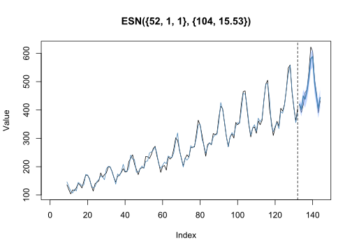

<!-- README.md is generated from README.Rmd. Please edit that file -->

# echos 

<!-- badges: start -->

[](https://cran.r-project.org/package=echos)
[](https://lifecycle.r-lib.org/articles/stages.html#stable)
[](https://www.gnu.org/licenses/gpl-3.0.en.html)
[](https://app.codecov.io/gh/ahaeusser/echos?branch=master)
[](https://github.com/ahaeusser/echos/actions/workflows/R-CMD-check.yaml)


<!-- badges: end -->

The `echos` package provides a comprehensive set of **functions and
methods** for modeling and forecasting univariate time series using
**Echo State Networks (ESNs)**. It offers two alternative approaches:

- **Base R interface:** Functions for modeling and forecasting time
  series using `numeric` vectors, allowing for straightforward
  integration with existing R workflows.
- **Tidy interface:** A seamless integration with the
  [`fable`](https://github.com/tidyverts/fable) framework based on
  [`tsibble`](https://github.com/tidyverts/tsibble), enabling tidy time
  series forecasting and model evaluation. This interface leverages the
  [`fabletools`](https://github.com/tidyverts/fabletools) package,
  providing a consistent and streamlined workflow for model development,
  evaluation, and visualization.

The package features a **lightweight implementation** that enables
**fast and fully automatic** model training and forecasting using ESNs.
You can quickly and easily build accurate ESN models without requiring
extensive hyperparameter tuning or manual configuration.

## Installation

You can install the **stable** version from
[CRAN](https://cran.r-project.org/package=echos):

``` r
install.packages("echos")
```

You can install the **development** version from
[GitHub](https://github.com/):

``` r
# install.packages("devtools")
devtools::install_github("ahaeusser/echos")
```

## Base R

``` r
library(echos)

# Forecast horizon
n_ahead <- 12 # forecast horizon
# Number of observations
n_obs <- length(AirPassengers)
# Number of observations for training
n_train <- n_obs - n_ahead

# Prepare train and test data
xtrain <- AirPassengers[(1:n_train)]
xtest <- AirPassengers[((n_train+1):n_obs)]

# Train and forecast ESN model
xmodel <- train_esn(y = xtrain)
xfcst <- forecast_esn(xmodel, n_ahead = n_ahead)

# Plot result
plot(xfcst, test = xtest)
```



## Tidy R

``` r
library(echos)
library(tidyverse)
library(tsibble)
library(fable)

# Prepare train data
train_frame <- m4_data %>%
  filter(series %in% c("M21655", "M2717"))

# Train and forecast ESN model
train_frame %>%
  model(
    "ESN" = ESN(value),
    "ARIMA" = ARIMA(value)
    ) %>%
  forecast(h = 18) %>%
  autoplot(train_frame, level = NULL)
```


