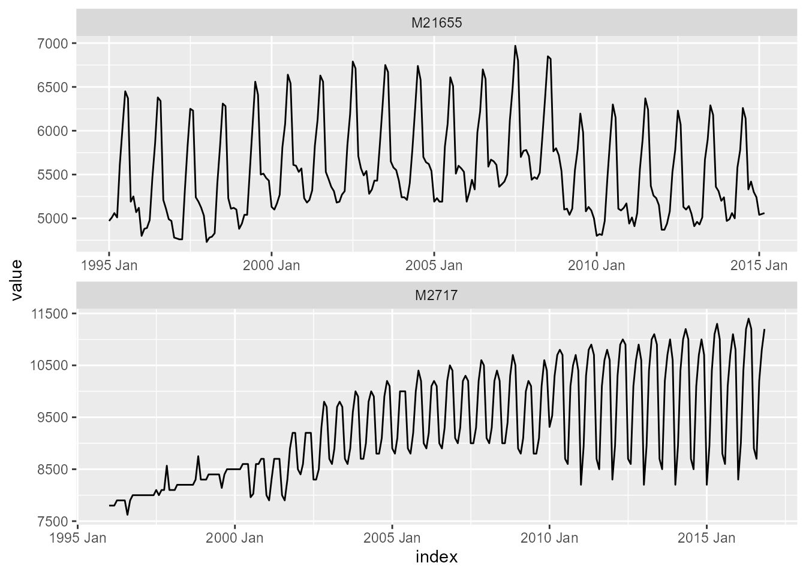

# Tidy functions

## Load package

``` r
library(echos)
library(tidyverse)
library(tsibble)
library(fable)
```

## Prepare dataset

In this example, we will use the `m4_data`. The dataset is a monthly
`tsibble`, which is filtered to include only the time series `"M21655"`
and `"M2717"`. The resulting object `train_frame` contains the training
data and is visualized below.

``` r
train_frame <- m4_data %>%
  filter(series %in% c("M21655", "M2717"))

train_frame
#> # A tsibble: 494 x 4 [1M]
#> # Key:       series [2]
#>    series category       index value
#>    <chr>  <fct>          <mth> <dbl>
#>  1 M21655 Demographic 1995 Jan  4970
#>  2 M21655 Demographic 1995 Feb  5010
#>  3 M21655 Demographic 1995 Mrz  5060
#>  4 M21655 Demographic 1995 Apr  5010
#>  5 M21655 Demographic 1995 Mai  5610
#>  6 M21655 Demographic 1995 Jun  6040
#>  7 M21655 Demographic 1995 Jul  6450
#>  8 M21655 Demographic 1995 Aug  6370
#>  9 M21655 Demographic 1995 Sep  5190
#> 10 M21655 Demographic 1995 Okt  5250
#> # ℹ 484 more rows

p <- ggplot()

p <- p + geom_line(
  data = train_frame,
  aes(
    x = index,
    y = value),
  linewidth = 0.5
)

p <- p + facet_wrap(
  vars(series),
  ncol = 1,
  scales = "free")

p
```



## Train ESN model

The function
[`ESN()`](https://ahaeusser.github.io/echos/reference/ESN.md) is used in
combination with
[`model()`](https://fabletools.tidyverts.org/reference/model.html) from
the `fabletools` package to train an Echo State Network for the variable
`value`. The trained models are stored as a `mable` (i.e., *model
table*). Additionally, an
[`ARIMA()`](https://fable.tidyverts.org/reference/ARIMA.html) model is
trained as a benchmark.

``` r
mable_frame <- train_frame %>%
  model(
    "ESN" = ESN(value),
    "ARIMA" = ARIMA(value)
    )

mable_frame
#> # A mable: 2 x 3
#> # Key:     series [2]
#>   series                              ESN                     ARIMA
#>   <chr>                           <model>                   <model>
#> 1 M21655   <ESN({97, 1, 1}, {194, 25.8})> <ARIMA(1,0,0)(1,1,2)[12]>
#> 2 M2717  <ESN({100, 1, 1}, {200, 28.78})> <ARIMA(2,1,4)(0,1,0)[12]>
```

## Forecast ESN model

Forecasts are generated via the function
[`forecast()`](https://generics.r-lib.org/reference/forecast.html),
where the forecast horizon is set to `h = 18` (i.e., 18-month-ahead
forecasts). The forecasts are stored as a `fable` (i.e., *forecast
table*) and visualized along the historical training data.

``` r
fable_frame <- mable_frame %>%
  forecast(h = 18)

fable_frame
#> # A fable: 72 x 5 [1M]
#> # Key:     series, .model [4]
#>    series .model    index
#>    <chr>  <chr>     <mth>
#>  1 M21655 ESN    2015 Apr
#>  2 M21655 ESN    2015 Mai
#>  3 M21655 ESN    2015 Jun
#>  4 M21655 ESN    2015 Jul
#>  5 M21655 ESN    2015 Aug
#>  6 M21655 ESN    2015 Sep
#>  7 M21655 ESN    2015 Okt
#>  8 M21655 ESN    2015 Nov
#>  9 M21655 ESN    2015 Dez
#> 10 M21655 ESN    2016 Jan
#> # ℹ 62 more rows
#> # ℹ 2 more variables: value <dist>, .mean <dbl>

fable_frame %>%
  autoplot(train_frame, level = NULL)
#> Warning: `autoplot.fbl_ts()` was deprecated in fabletools 0.6.0.
#> ℹ Please use `ggtime::autoplot.fbl_ts()` instead.
#> ℹ Graphics functions have been moved to the {ggtime} package. Please use
#>   `library(ggtime)` instead.
#> This warning is displayed once per session.
#> Call `lifecycle::last_lifecycle_warnings()` to see where this warning was
#> generated.
```


