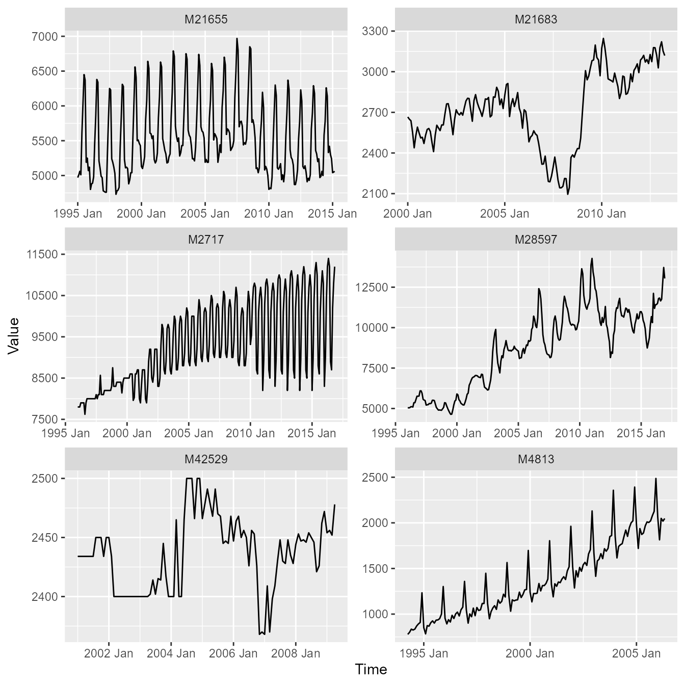

# Datasets

## Introduction

This vignette gives you a quick tour of the **time series datasets**
embedded in `echos`:

- `m4_data`: Six monthly time series drawn from the well‑known M4
  Forecasting Competition.
- `synthetic_data`: Ten synthetic time series, useful for teaching,
  prototyping and testing.

## Load packages

``` r
library(echos)
library(tidyverse)
library(tsibble)
```

## M4 data

The dataset `m4_data` is a `tsibble` with six monthly time series from
the M4 Forecasting Competition. The datasets contains the following time
series:

- M21655 (Demographic), 1995 Jan - 2015 Mar
- M21683 (Demographic), 2000 Jan - 2023 Apr
- M2717 (Macro), 1996 Jan - 2016 Nov
- M28597 (Industry), 1996 Jan - 2016 Dec
- M42529 (Finance), 2001 Jan - 2009 Apr
- M4813 (Macro), 1994 Apr - 2006 May

``` r
m4_data
#> # A tsibble: 1,152 x 4 [1M]
#> # Key:       series [6]
#>    series category       index value
#>    <chr>  <fct>          <mth> <dbl>
#>  1 M21655 Demographic 1995 Jan  4970
#>  2 M21655 Demographic 1995 Feb  5010
#>  3 M21655 Demographic 1995 Mrz  5060
#>  4 M21655 Demographic 1995 Apr  5010
#>  5 M21655 Demographic 1995 Mai  5610
#>  6 M21655 Demographic 1995 Jun  6040
#>  7 M21655 Demographic 1995 Jul  6450
#>  8 M21655 Demographic 1995 Aug  6370
#>  9 M21655 Demographic 1995 Sep  5190
#> 10 M21655 Demographic 1995 Okt  5250
#> # ℹ 1,142 more rows
```



## Synthetic data

The dataset `synthetic_data` is a `tibble` with ten synthetic time
series. The dataset contains the following time series:

- Square Wave
- Sawtooth Wave
- Harmonic Wave
- Harmonic Wave w/ Trend
- Amplitude Modulated Wave
- Frequency Modulated Wave
- AR(1) Process
- MA(2) Process
- White Noise Process
- Random Walk Process

``` r
synthetic_data
#> # A tibble: 2,000 × 3
#>    variable    index value
#>    <chr>       <int> <dbl>
#>  1 Square Wave     1     1
#>  2 Square Wave     2     1
#>  3 Square Wave     3     1
#>  4 Square Wave     4     1
#>  5 Square Wave     5     1
#>  6 Square Wave     6     1
#>  7 Square Wave     7     1
#>  8 Square Wave     8     1
#>  9 Square Wave     9     1
#> 10 Square Wave    10     1
#> # ℹ 1,990 more rows
```


